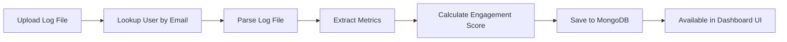

# Engagement Log Upload API Contract

**Version:** 1.0  
**Last Updated:** April 2, 2026  
**Endpoint:** `POST /api/engagement/upload-logs`
**API SECRET** `mjChX6tbCx8tKsMEpbsCKRDwNVGgBVt5`
---

## Overview

This API enables the app team to upload daily engagement logs for users. The system automatically:
1. Looks up users by email address
2. Parses device logs using `FalconEngagementLunaAppParser`
3. Extracts HR, Sleep, Activity, and SpO2 metrics
4. Calculates engagement scores (0-100)
5. Stores data in MongoDB (`DailyEngagementMetrics` collection)
6. Makes data immediately available in the engagement dashboard UI

---

## Endpoint Details

### **URL**
```
POST http://localhost:5050/api/engagement/upload-logs
```

### **Authentication**
- ✅ **API Key Required** (via `X-API-Key` header)
- Protects against unauthorized uploads
- Simple server-to-server authentication
- API secret configured in `.env` file as `ENGAGEMENT_API_SECRET`

**Security:**
- Uses constant-time comparison to prevent timing attacks
- Returns 401 if key missing, 403 if invalid

### **Content Type**
```
multipart/form-data
```

### **Max File Size**
- 10 MB per file

---

## Request Parameters

### **Required Headers**

| Header Name | Type | Required | Description | Example |
|-------------|------|----------|-------------|---------|
| `X-API-Key` | String | ✅ Yes | API secret key for authentication | `X-API-Key: abc123xyz789...` |
| `Content-Type` | String | ✅ Yes | Must be `multipart/form-data` | Auto-set by form libraries |

### **Form Data Fields**

For **each log file**, provide the following fields:

| Field Name | Type | Required | Description | Example |
|------------|------|----------|-------------|---------|
| `<fieldname>` | File | ✅ Yes | The log file itself | `logFile` |
| `email_<fieldname>` | String | ✅ Yes | User's email address (case-insensitive) | `email_logFile=john.doe@example.com` |
| `date_<fieldname>` | String | ⚪ No | Date in `YYYY-MM-DD` format (defaults to current date) | `date_logFile=2026-04-02` |

**Important:** The `<fieldname>` must be **identical** across the file and its metadata fields.

---H "X-API-Key: your-secret-key-here" \
  -F "logFile=@/path/to/1774004358807_appLogs.txt" \
  -F "email_logFile=john.doe@example.com" \
  -F "date_logFile=2026-04-02"
```

### **Multiple Files Upload (curl)**
```bash
curl -X POST http://localhost:5050/api/engagement/upload-logs \
  -H "X-API-Key: your-secret-key-here"
  -F "email_logFile=john.doe@example.com" \
  -F "date_logFile=2026-04-02"
```

### **Multiple Files Upload (curl)**
```bash
curl -X POST http://localhost:5050/api/engagement/upload-logs \
  -F "file1=@/path/to/alice_logs.txt" \
  -F "email_file1=alice@example.com" \
  -F "date_file1=2026-04-02" \
  -F "file2=@/path/to/bob_logs.txt" \
  -F "email_file2=bob@company.com" \
  -F "date_file2=2026-04-02" \
  -F "file3=@/path/to/charlie_logs.txt" \
  -F "email_file3=charlie@startup.io" \
  -F "date_file3=2026-04-02"
```

### **JavaScript/Node.js Example**
```javascript
const FormData = require('form-data');
const fs = require('fs');
const axios = require('axios');

async function uploadLog(filePath, email, date) {
  const formData = new FormData();
  
  formData.append('logFile', fs.createReadStream(filePath));
  formData.append('email_logFile', email);
  formData.append('date_logFile', date);
  
  const response = await axios.post(
    'http://localhost:5050/api/engagement/upload-logs',
    formData,{
        ...formData.getHeaders(),
        'X-API-Key': process.env.ENGAGEMENT_API_SECRET
      },
      maxContentLength: Infinity,
      maxBodyLength: Infinity
    }
  );
  
  return response.data;
}

// Usage
uploadLog('./appLogs.txt', 'user@example.com', '2026-04-02')
  .then(result => console.log('Upload successful:', result))
  .catch(error => console.error('Upload failed:', error));
```

### **Python Example**
```python
import requests
import os

def upload_log(file_path, email, date):
    url = 'http://localhost:5050/api/engagement/upload-logs'
    
    headers = {
        'X-API-Key': os.environ.get('ENGAGEMENT_API_SECRET')
    }
    
    files = {
        'logFile': open(file_path, 'rb')
    }
    
    data = {
        'email_logFile': email,
        'date_logFile': date
    }
    
    response = requests.post(url, headers=headers
    
    response = requests.post(url, files=files, data=data)
    return response.json()

# Usage
result = upload_log('./appLogs.txt', 'user@example.com', '2026-04-02')
print(result)
```

---

## Response Formats

### **✅ Success Response**

**Status Code:** `200 OK`

```json
{
  "success": true,
  "message": "Log upload completed",
  "results": [
    {
      "fileName": "1774004358807_appLogs.txt",
      "email": "john.doe@example.com",
      "userName": "John Doe",
      "userId": "65f8a3b2c4d5e6f7g8h9i0j1",
      "status": "success"
    }
  ]
}
```

**Response Fields:**
- `success` (boolean): Overall upload completion status
- `message` (string): Human-readable status message
- `results` (array): Array of individual file processing results
  - `filMissing API Key**

**Status Code:** `401 Unauthorized`

```json
{
  "success": false,
  "message": "API key is required. Please provide X-API-Key header."
}
```

**Solution:** Add `X-API-Key` header with valid API secret.

---

### **❌ Invalid API Key**

**Status Code:** `403 Forbidden`

```json
{
  "success": false,
  "message": "Invalid API key"
}
```

**Solution:** Verify the API key matches `ENGAGEMENT_API_SECRET` in `.env` file.

---

### **❌ eName` (string): Original filename
  - `email` (string): User email from request
  - `userName` (string): User's full name from database
  - `userId` (string): MongoDB ObjectId of the user
  - `status` (string): `"success"` or `"failed"`

---

## Error Responses

### **❌ User Not Found**

**Status Code:** `200 OK` (partial success)

The upload completes but individual files may fail if user doesn't exist.

```json
{
  "success": true,
  "message": "Log upload completed",
  "results": [
    {
      "fileName": "unknown_user_logs.txt",
      "email": "nonexistent@example.com",
      "status": "failed",
      "error": "User not found with email: nonexistent@example.com"
    }
  ]
}
```

**Solution:** Ensure the user exists in the database before uploading their logs.

---

### **❌ No Files Uploaded**

**Status Code:** `400 Bad Request`

```json
{
  "success": false,
  "message": "No files uploaded"
}
```

**Solution:** Include at least one file in the multipart form data.

---

### **❌ Missing Email Parameter**

**Status Code:** `200 OK` (partial success)

```json
{
  "success": true,
  "message": "Log upload completed",
  "results": [
    {
      "fileName": "logs.txt",
      "status": "failed",
      "error": "Email not provided for this file"
    }
  ]
}
```

**Solution:** Ensure `email_<fieldname>` parameter matches the file field name.

---

### **❌ Log Parsing Error**

**Status Code:** `200 OK` (partial success)

```json
{
  "success": true,
  "message": "Log upload completed",
  "results": [
    {
      "fileName": "corrupted.txt",
      "status": "failed",
      "error": "Failed to parse log file: Invalid format at line 123"
    }
  ]
}
```

**Solution:** Verify log file format matches Luna Android app log structure.

---

### **❌ Server Error**

**Status Code:** `500 Internal Server Error`

```json
{
  "success": false,
  "message": "Failed to upload logs",
  "error": "Database connection timeout"
}
```

---

## Processing Pipeline

What happens after a successful upload:



### **Step-by-Step Breakdown:**

1. **User Lookup**
   - System searches `Users` collection for matching email
   - Email comparison is case-insensitive and trimmed
   - Returns MongoDB ObjectId if found

2. **Log Parsing**
   - Uses `FalconEngagementLunaAppParser`
   - Filters data for the specified date only
   - Extracts latest sync data if multiple syncs exist

3. **Metrics Extraction**
   - **Heart Rate:** 5-minute interval data points, avg/min/max, wear time
   - **Sleep:** Sleep score, stages (deep/rem/light/awake), hypnograph (minute-by-minute)
   - **Activity:** Steps, distance, calories, hourly breakdown
   - **SpO2:** 15-minute interval data points, avg/min/max

4. **Engagement Scoring** (0-100 scale)
   - Heart Rate: 25 points
   - Sleep: 25 points
   - Activity: 25 points
   - SpO2: 15 points
   - Workouts: 10 points (bonus)

5. **Database Storage**
   - Collection: `DailyEngagementMetrics`
   - Upsert operation (prevents duplicates)
   - Indexed by: `userId` + `date`
API_KEY="your-api-secret-key-here"  # Set from ENGAGEMENT_API_SECRET

echo "📤 Starting daily log upload for $DATE"

# Upload each log file
for log_file in "$LOGS_DIR"/*.txt; do
  if [ -f "$log_file" ]; then
    # Extract email from filename (format: email_logs.txt)
    EMAIL=$(basename "$log_file" | cut -d'_' -f1)
    
    echo "📄 Uploading: $(basename $log_file) for $EMAIL"
    
    curl -X POST "$API_URL" \
      -H "X-API-Key: $API_KEY logs)
- `.csv` (Future support)
- `.log` (Generic logs)

### **Expected Log Structure**

Luna Android app logs should contain sync data entries like:

```
2026-04-01 13:48:01.123 LUNA-> onContinuousHeartRateData: date='2026-04-01', hr=[...]
2026-04-01 13:48:02.456 LUNA-> onContinuousBloodOxygenData: date='2026-04-01', spo2=[...]
2026-04-01 13:48:03.789 LUNA-> onActivityData: date='2026-04-01', steps=12500, ...
2026-04-01 13:48:04.012 LUNA-> onSleepData: date='2026-04-01', sleepScore=85, ...
```

---

## Daily Automation Script

### **Bash Script for Linux/Mac**
```bash
#!/bin/bash
# Daily log upload automation (Run at 8 PM via cron)

DATE=$(date +%Y-%m-%d)
LOGS_DIR="/path/to/daily-logs/$DATE"
API_URL="http://localhost:5050/api/engagement/upload-logs"

echo "📤 Starting daily log upload for $DATE"

# Upload each log file
for log_file in "$LOGS_DIR"/*.txt; do
  if [ -f "$log_file" ]; then
    # Extract email from filename (format: email_logs.txt)
    EMAIL=$(basename "$log_file" | cut -d'_' -f1)
    
    echo "📄 Uploading: $(basename $log_file) for $EMAIL"
    
    curl -X POST "$API_URL" \
      -F "logFile=@$log_file" \
      -F "email_logFile=$EMAIL" \
      -F "dHeaders** tab → Add:
   - Key: `X-API-Key`
   - Value: Your API secret from `.env` file
4. Go to **Body** tab → Select **form-data**
5. Add fields:
   - Key: `logFile` (Type: File) → Select your log file
   - Key: `email_logFile` (Type: Text) → Enter user email
   - Key: `date_logFile` (Type: Text) → Enter date (YYYY-MM-DD)
6. Click **Send**

### **Using curl (Quick Test)**
```bash
# Test with sample data
curl -X POST http://localhost:5050/api/engagement/upload-logs \
  -H "X-API-Key: your-secret-key"
0 20 * * * /path/to/upload_daily_logs.sh >> /var/log/engagement_upload.log 2>&1
```

---

## File Naming Conventions

### **Recommended Format**
`{email}_{metric}_{timestamp}.txt`

### **Examples**
- `john.doe@example.com_logs_2026-04-02.txt`
- `alice_at_example.com_HR_1775031481.txt` (@ encoded as _at_)
- `bob-at-company.com_SPO2_1775031481.csv` (@ encoded as -at-)
API key is required"**
**Cause:** Missing `X-API-Key` header  
**Fix:** Add header to your request:
```bash
-H "X-API-Key: your-secret-key"
```

### **Issue: "Invalid API key"**
**Cause:** API key doesn't match server configuration  
**Fix:** 
1. Check `.env` file for `ENGAGEMENT_API_SECRET` value
2. Ensure you're using the exact same value in your request
3. Generate a new secret if needed: `node -e "console.log(require('crypto').randomBytes(32).toString('hex'))"`

### **Issue: "
**Note:** If email contains `@` symbol in filename, it may cause issues on some filesystems. Use encoding:
- `_at_` → `user_at_example.com`
- `-at-` → `user-at-example.com`

The upload tool (`uploadLogs.js`) automatically decodes these patterns back to email format.

---

## Testing the API

### **Using Postman**

1. Set method to `POST`
2. URL: `http://localhost:5050/api/engagement/upload-logs`
3. Go to **Body** tab → Select **form-data**
4. Add fields:
   - Key: `logFile` (Type: File) → Select your log file
   - Key: `email_logFile` (Type: Text) → Enter user email
   - Key: `date_logFile` (Type: Text) → Enter date (YYYY-MM-DD)
5. Click **Send**

### **Using curl (Quick Test)**
```bash
# Test with sample data
curl -X POST http://localhost:5050/api/engagement/upload-logs \
  -F "testFile=@./dummy-data/1774004358807_appLogs.txt" \
  ✅ **API Key Authentication**: Endpoint protected with constant-time comparison
- ✅ **Timing Attack Prevention**: Uses `crypto.timingSafeEqual()` for secure comparison
- ⚠️ **HTTPS Required in Production**: Always use HTTPS to prevent key interception
- ⚠️ **Keep API Secret Secure**: Never commit `.env` file to version control
- ⚠️ **Rotate Keys Regularly**: Update `ENGAGEMENT_API_SECRET` periodically

**Recommended additional security measures:**
- Rate limiting (e.g., 100 requests/hour per IP)
- Request size limits (already set to 10MB per file)
- File content validation/sanitization
- IP whitelisting for known app servers
- Logging of all upload attempts for audit trail

## Troubleshooting

### **Issue: "User not found with email: xxx"**
**Cause:** Email doesn't exist in Users collection  
**Fix:**
```javascript
// Add user to database first
db.users.insertOne({
  name: "John Doe",
  email: "john.doe@example.com",
  role: "tester",
  createdAt: new Date()
});
```

### **Issue: "No files uploaded"**
**Cause:** Incorrect form field name or missing file  
**Fix:** Ensure file field exists and matches the email parameter pattern

### **Issue: "Failed to parse log file"**
**Cause:** Log file format doesn't match expected structure  
**Fix:** Verify log file contains Luna Android app sync data entries

### **Issue: Upload succeeds but no data in dashboard**
**Cause:** Date mismatch or parser couldn't extract data for specified date  
**Fix:**
- Check `date_<fieldname>` matches data in log file
- Verify log contains sync entries for that specific date
- Check MongoDB for saved entry: `db.dailyengagementmetrics.find({userId: "xxx", date: ISODate("2026-04-02")})`

---

## Performance Considerations

- **Max concurrent uploads:** 10 files
- **Single file processing time:** ~2-5 seconds
- **Recommended batch size:** 50-100 users per upload session
- **Peak load handling:** Queue system for >100 simultaneous uploads

---

## Security Notes

- ⚠️ Endpoint is **public** (no authentication required)
- Consider adding:
  - Rate limiting (e.g., 100 requests/hour per IP)
  - API key for production deployments
  - File content validation/sanitization
  - Virus scanning for uploaded files

---

## Related Documentation

- [Engagement API Quick Reference](./ENGAGEMENT_API_QUICK_REFERENCE.md)
- [Upload Tool Script](../tools/uploadLogs.js)
- [Upload Tool README](../tools/README.md)
- [Parser Documentation](../src/parsers/engagementparser/README.md)

---

## Change Log

| Version | Date | Changes |
|---------|------|---------|
| 1.0 | 2026-04-02 | Initial API contract with email-based user lookup |
| 0.9 | 2026-03-31 | Previous version using userId (deprecated) |

---

## Support

For issues or questions:
- Check existing logs: `server/temp/engagement-logs/`
- Review parser code: `server/src/parsers/engagementparser/FalconEngagementLunaAppParser.ts`
- Test with sample data: `dummy-data/1774004358807_appLogs.txt`
